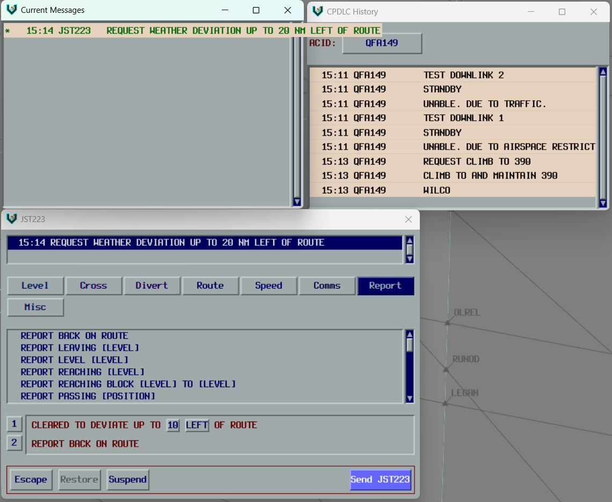

<h1 align="center">
  CPDLC Plugin
</h1>

<h3 align="center">
  A vatSys plugin enabling support for CPDLC via a relay server.

  [](https://github.com/YuKitsune/CPDLCPlugin/actions/workflows/build.yml)
  [](https://github.com/YuKitsune/CPDLCPlugin/blob/main/LICENSE)
  [](https://github.com/YuKitsune/CPDLCPlugin/releases)

  
</h3>

## Overview

This plugin enables CPDLC (Controller-Pilot Data Link Communications) functionality in vatSys, allowing controllers to send and receive datalink messages with aircraft on the VATSIM network.

> [!NOTE]
> This plugin requires a CPDLC Server to function. For information on how the system works and how to configure the server, see the [Server Documentation](docs/SERVER.md).

## Installation

Before installing the CPDLC Plugin, ensure you have the following:

- [vatSys](https://virtualairtrafficsystem.com/) (version 1.4.20 or later)
- .NET Framework 4.7.2 or later

### Installing from GitHub

1. Download the [latest release from GitHub](https://github.com/YuKitsune/CPDLCPlugin/releases).
2. Extract the `CPDLCPlugin.zip` file into your vatSys plugins directory (`Documents\vatSys Files\Profiles\<Profile Name>\Plugins\CPDLCPlugin`).
3. Run the `unblock-dlls.bat` helper script (included in the `CPDLCPlugin.zip` file) to unblock all the `.dll` files.

### Verifying Installation

1. Open vatSys.
2. Look for the `CPDLC` menu item in the vatSys menu bar.

> [!TIP]
> If you do not see the `CPDLC` menu item after restarting vatSys, refer to the [Troubleshooting](#troubleshooting) section below.

### CPDLC Label Items

In order to use the CPDLC label items, you need to replace the default CPDLC label items in the `Labels.xml` file in the profile.

Replace each occurence of `<Item Type="LABEL_ITEM_CPDLC" Colour="" BackgroundColour="CPDLCDownlink" LeftClick="Label_CPDLC_Menu" MiddleClick="Label_CPDLC_Message_Toggle" RightClick="Label_CPDLC_Editor" />` with the following lines:

```xml
<Item Type="CPDLCPLUGIN_CPDLCSTATUS" />
<Item Type="CPDLCPLUGIN_CPDLCSTATUS_BG" BackgroundColour="Custom" />
<Item Type="CPDLCPLUGIN_TEXTSTATUS" />
<Item Type="CPDLCPLUGIN_TEXTSTATUS_BG" BackgroundColour="Custom" />
```

## Troubleshooting

### CPDLC menu item not appearing

If the CPDLC menu item does not appear, it's likely that the `.dll` files for the plugin have been blocked by Windows.
This is a security feature in Windows that blocks files downloaded from the internet to protect your computer from potentially harmful software.

1. Locate the `unblock-dlls.bat` file (included in the `CPDLCPlugin.zip` file).
2. Ensure the file is located in the same folder as the `.dll` files, or in one of the folders above it.
3. Run the script by double-clicking it. You will be shown a list of all the `.dll` files the script will unblock. Press `Y` to continue, or `N` to exit.
4. Restart vatSys once the script has completed.

This script will search for any `.dll` files in the current folder or sub-folders and ensure they are unblocked.

### DPI Awareness

If you are using a high-resolution display (4K monitor, high-DPI laptop screen, etc.) and experience graphical issues after launching vatSys, you may need to run the `dpiawarefix.bat` script.

1. Locate the `dpiawarefix.bat` file (included in the `CPDLCPlugin.zip` file).
2. Run the script by double-clicking it.
3. Restart vatSys.

This script adjusts Windows DPI settings for vatSys, making it compatible with high-resolution displays.
