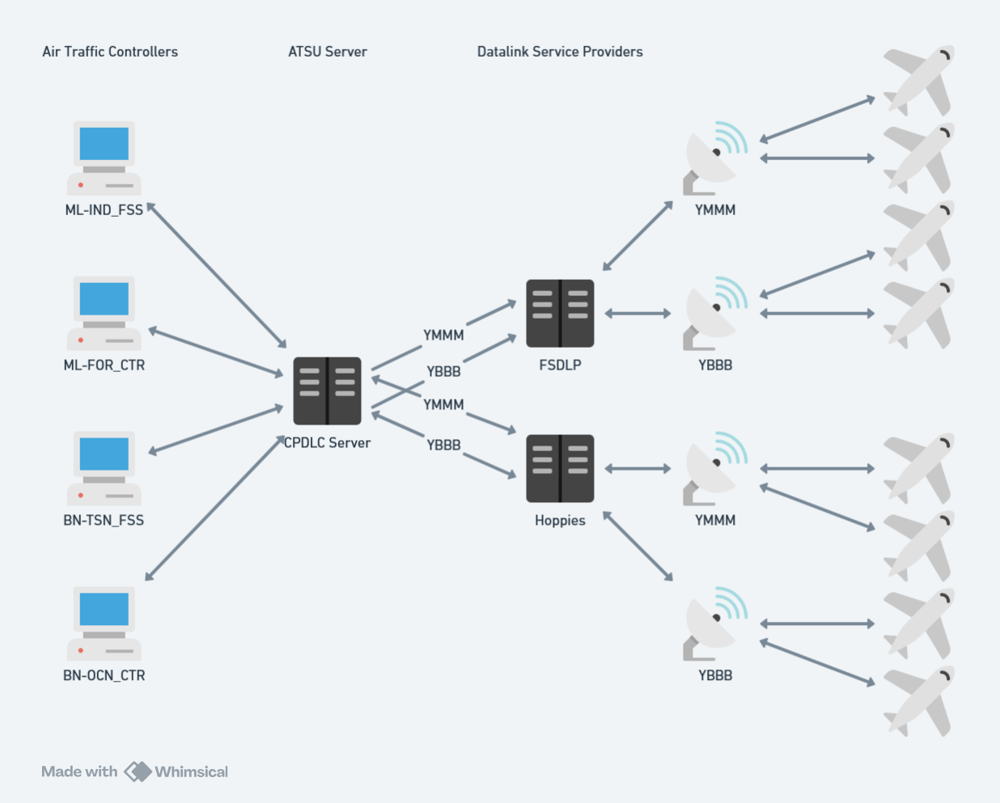

# CPDLC Server



The server maintains one or more connections to upstream ACARS networks (i.e. [Hoppies](https://www.hoppie.nl/acars/)).
Each connection simulates a single air traffic service unit (ATSU), such as Brisbane (YBBB) or Melbourne (YMMM).
The server will relay CPDLC messages between air traffic controllers to the upstream ACARS network, allowing pilots to connect to a single unit and communicate with all enroute controllers within that unit.

The server also allows for connections to multiple ACARS networks, enabling you to communicate with aircraft on different ACARS networks (Hoppies, FSDLP, etc.) or host multiple ATSUs from a single server instance.

## Prerequisites

Before running the CPDLC Server, ensure you have:

- [.NET 10.0 SDK](https://dotnet.microsoft.com/download) or later (for local development)
- [Docker](https://www.docker.com/get-started) (for Docker deployment)
- A Hoppies ACARS account and logon code from [hoppie.nl](https://www.hoppie.nl/acars/system/register.html)

## Configuration

The server can be configured using environment variables.
Copy `example.env` to `.env` and update with your settings:

```bash
# Logging
Logging__Level=Information

# Database (SQLite by default)
ConnectionStrings__DefaultConnection=Data Source=cpdlc.db

# ACARS Client Configuration
Acars__0__Type=Hoppie
Acars__0__FlightSimulationNetwork=VATSIM
Acars__0__StationIdentifier=YBBB
Acars__0__Url=http://www.hoppie.nl/acars/system/connect.html
Acars__0__AuthenticationCode=your-hoppie-logon-code
```

### Multiple ACARS Connections

You can configure multiple ACARS clients by incrementing the index (`Acars__1__`, `Acars__2__`, etc.). This is useful when serving multiple ATSUs (e.g., YBBB and YMMM)

Example configuration for multiple connections:

```bash
# Brisbane FIR
Acars__0__Type=Hoppie
Acars__0__FlightSimulationNetwork=VATSIM
Acars__0__StationIdentifier=YBBB
Acars__0__Url=http://www.hoppie.nl/acars/system/connect.html
Acars__0__AuthenticationCode=your-ybbb-hoppie-code

# Melbourne FIR
Acars__1__Type=Hoppie
Acars__1__FlightSimulationNetwork=VATSIM
Acars__1__StationIdentifier=YMMM
Acars__1__Url=http://www.hoppie.nl/acars/system/connect.html
Acars__1__AuthenticationCode=your-ymmm-hoppie-code
```

> [!NOTE]
> `Hoppie` is currently the only supported ACARS network type.

## Running

### Docker

```bash
docker-compose up
```

The server will be available at `http://localhost:5272`.

### Local Development

```bash
dotnet run --project source/CPDLCServer/CPDLCServer.csproj
```

The server will start on `http://localhost:5261`.

## Plugin Configuration

Once the server is running, you need to configure the CPDLC Plugin to connect to it.

1. Locate the `CPDLC.json` file in your vatSys profile directory:
   - `Documents\vatSys Files\Profiles\<Profile Name>\Plugins\CPDLCPlugin\CPDLC.json`

2. Update the configuration:

```json
{
  "ServerEndpoint": "http://localhost:5261/hubs/controller",
  "Stations": ["YBBB", "YMMM"]
}
```

### Configuration Options

- **ServerEndpoint**: The SignalR hub URL for the CPDLC server. This is typically the server adress and the `/hubs/controller` path.
- **Stations**: Array of station identifiers (ATSUs) that this plugin instance will handle. These should match the `StationIdentifier` values configured in your server's ACARS connections.
